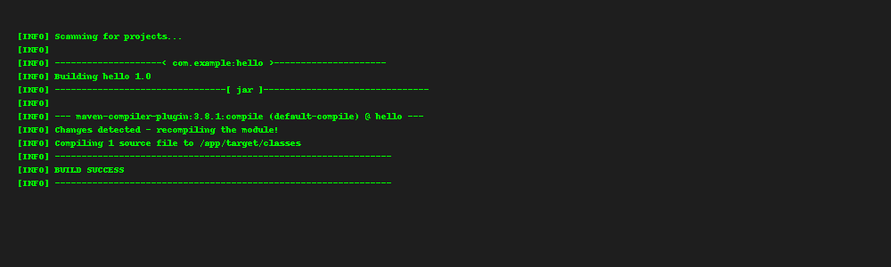

# Hello Java Maven - Jenkins Build

## Description
A basic Java HelloWorld application built with Maven in Jenkins.

## Build Status
(Screenshot goes here)

## Steps:
- Java + Maven setup
- Jenkins Freestyle job using `clean package`

